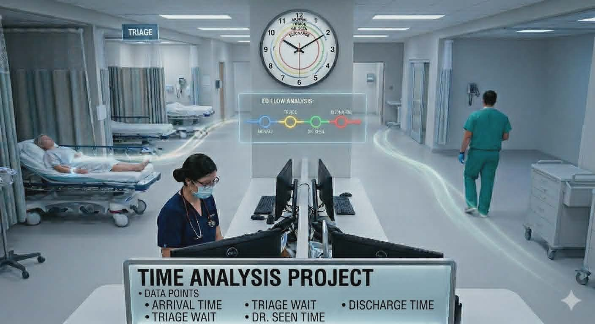
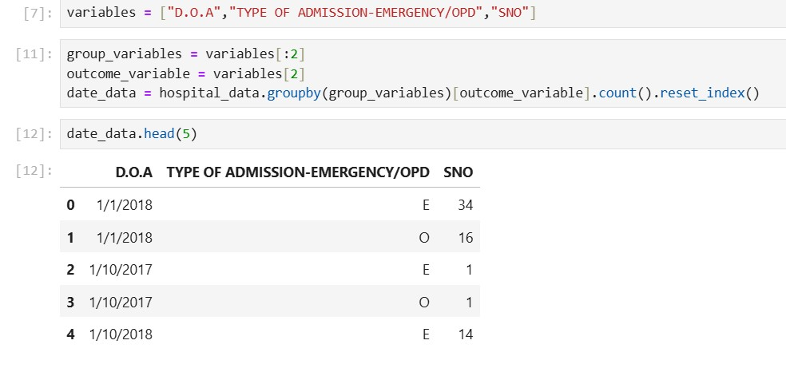
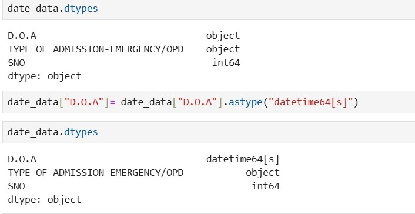
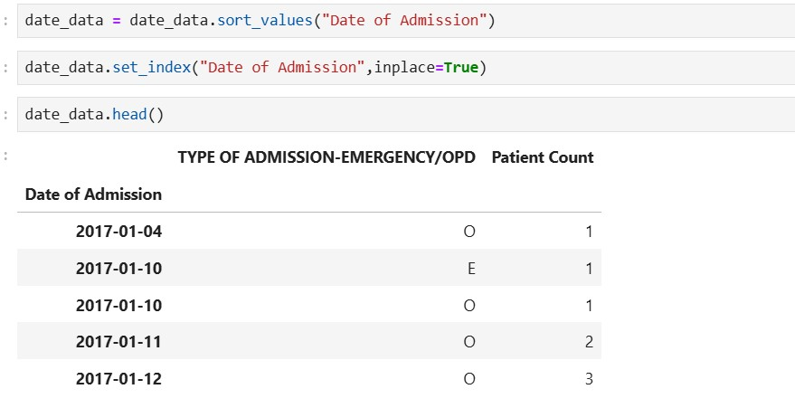
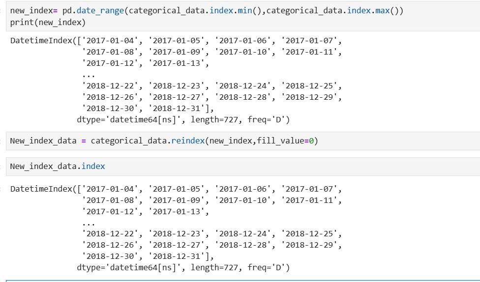

# 🏥 Emergency Admissions Forecasting using Time Series Analysis

## 🚨 Why Emergency depertement Forcasting is important?

- Unplanned emergency admissions leads to significant stress on hospital resources and staff.
- Accurate forecasting enables hospitals to **allocate staff, beds, and resources proactively**.
- Predictive models can flag high-demand periods **before they occur**, supporting operational planning
  
## 📊 Dataset Overview
Daily hospital admissions data with the following characteristics:
- **Source**: HDHI Admission Data
- **Period**: April 2017 – December 2018 (~640 days)
- **Target variable**: Daily emergency admission count

## 🧠 Workflow Summary
 
### 🔹 Data Preprocessing
- Parsed and converted admission dates to datetime format
- Grouped admissions by date and type (Emergency vs OPD)
- Reindexed to a continuous daily date range, filling missing dates with zero

### 🔹 Exploratory Data Analysis
- Aggregated data at weekly, monthly, quarterly, and yearly levels
- Computed rolling mean, rolling standard deviation, and cumulative admissions
- Calculated month-over-month and quarter-over-quarter percentage changes
- Analysed ACF and PACF plots at daily and weekly levels
- Generated month plots and quarter plots to identify seasonal patterns

