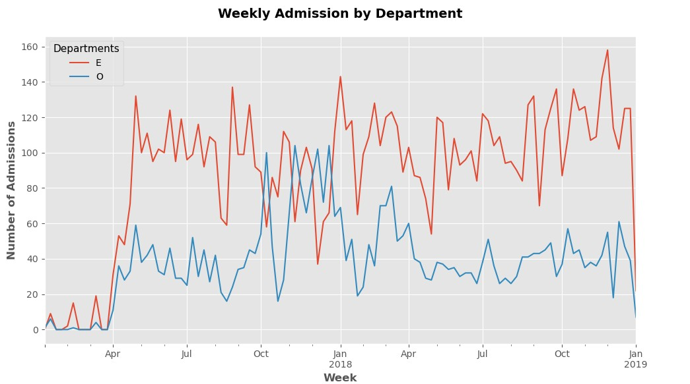
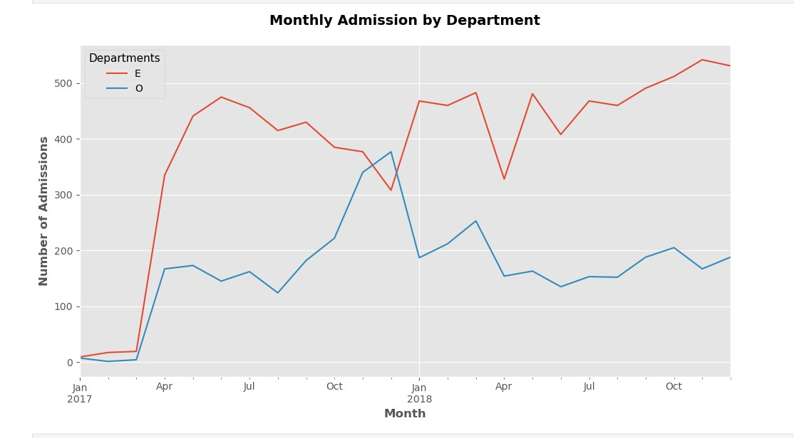
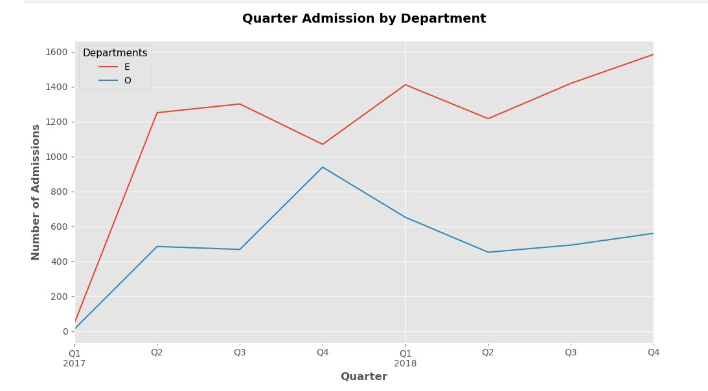
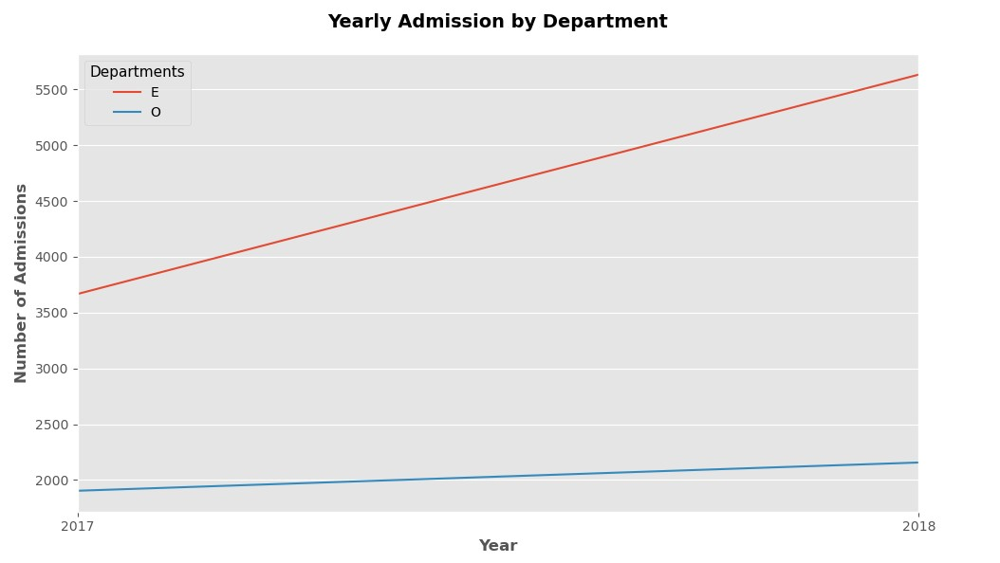
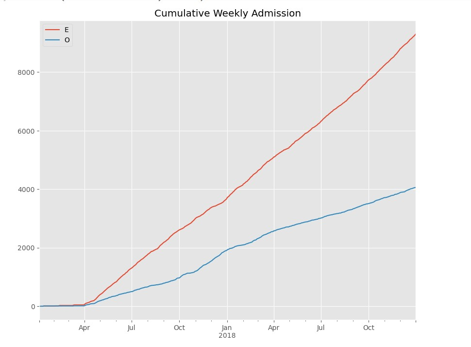
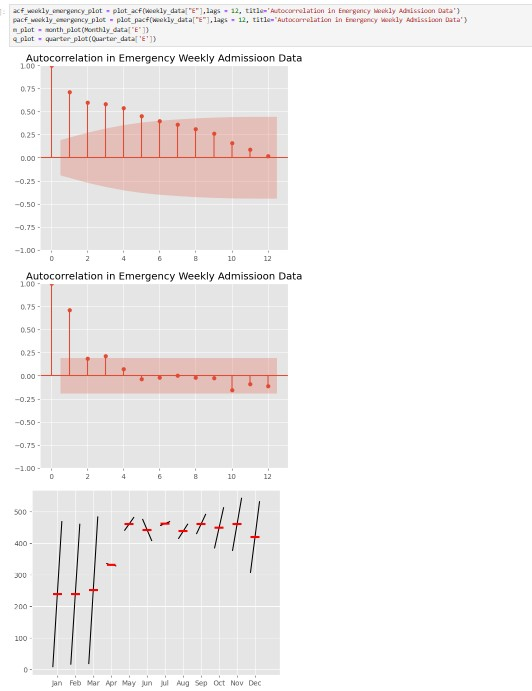
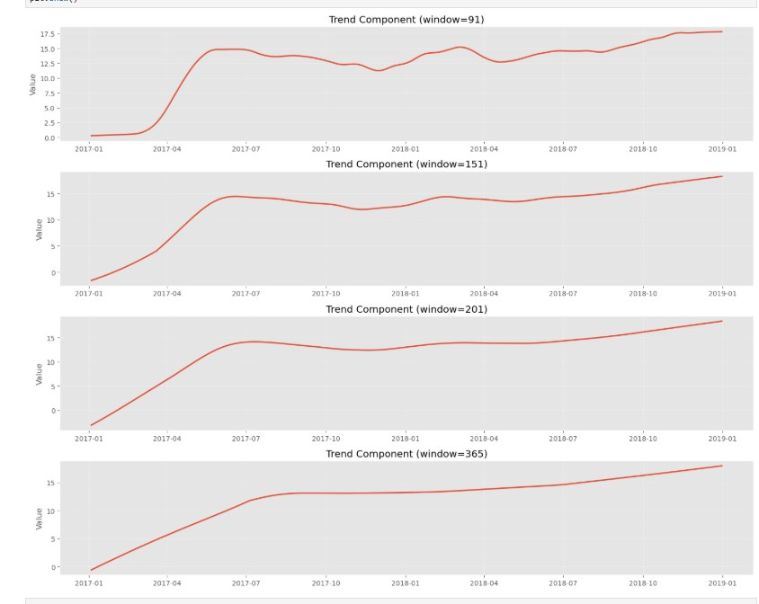
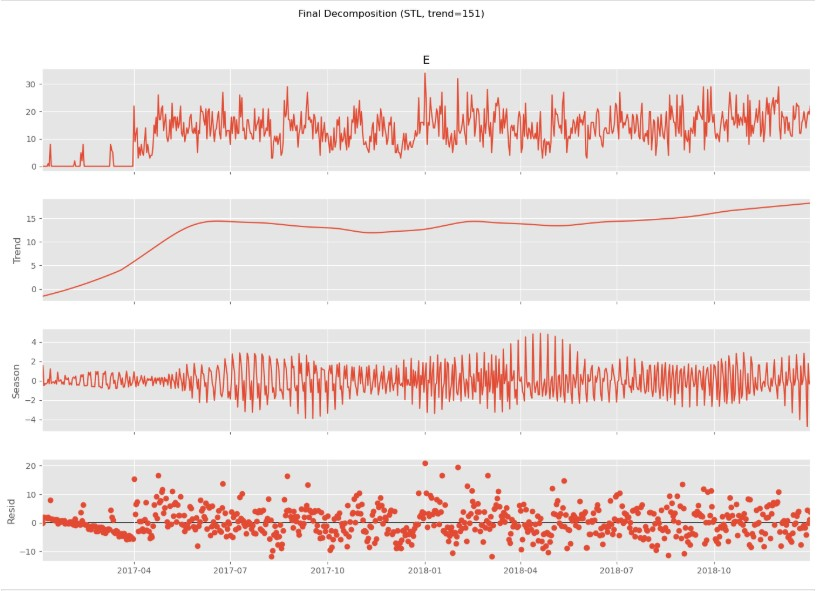
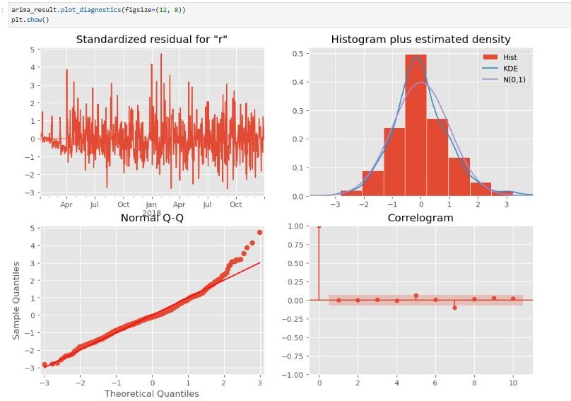

# 🏥 Emergency Admissions Forecasting using Time Series Analysis

## 🚨 Why Emergency depertement Forcasting is important?

- Unplanned emergency admissions leads to significant stress on hospital resources and staff.
- Accurate forecasting enables hospitals to **allocate staff, beds, and resources proactively**.
- Predictive models can flag high-demand periods **before they occur**, supporting operational planning
  
## 📊 Dataset Overview
Daily hospital admissions data with the following characteristics:
- **Source**: HDHI Admission Data
- **Period**: April 2017 – December 2018 (~640 days)
- **Target variable**: Daily emergency admission count

## 🧠 Workflow Summary
 
### 🔹 Data Preprocessing
- Parsed and converted admission dates to datetime format
- Grouped admissions by date and type (Emergency vs OPD)
- Reindexed to a continuous daily date range, filling missing dates with zero

### 🔹 Exploratory Data Analysis
- Aggregated data at weekly, monthly, quarterly, and yearly levels
- Computed rolling mean, rolling standard deviation, and cumulative admissions
- Calculated month-over-month and quarter-over-quarter percentage changes
- Analysed ACF and PACF plots at daily and weekly levels
- Generated month plots and quarter plots to identify seasonal patterns

### 🔹 Decomposition
- Explored classical additive decomposition for initial visual inspection
- Applied **STL decomposition** (Seasonal-Trend decomposition using LOESS) directly to the original emergency series
  - `seasonal = 13`, `trend = 151`, `robust = True`
  - Compared multiple trend window sizes (91, 151, 201, 365) before selecting 151

**STL Components:**
 
| Component | Role |
|---|---|
| **Trend** | Long-run direction of admissions (~15–20/day) |
| **Seasonal** | Weekly recurring pattern (Monday peak, Sunday low) |
| **Residual** | Remaining noise passed to ARIMA |

### 🔹 Stationarity Testing
- Ran Augmented Dickey-Fuller (ADF) test on STL residuals
- **Result**: ADF = -12.92, p-value ≈ 0.000 → Residuals confirmed stationary ✅
- No differencing required (d = 0)

### 🔹 ARIMA Modelling
- Manually identified candidate orders from ACF/PACF plots
- Used `auto_arima` (pmdarima) to confirm optimal order
- **Selected model**: `ARIMA(3,0,0)` with no intercept
- Validated using:
  - Ljung-Box test (p = 0.90 → white noise confirmed ✅)
  - Diagnostic plots: standardised residuals, Q-Q plot, correlogram

